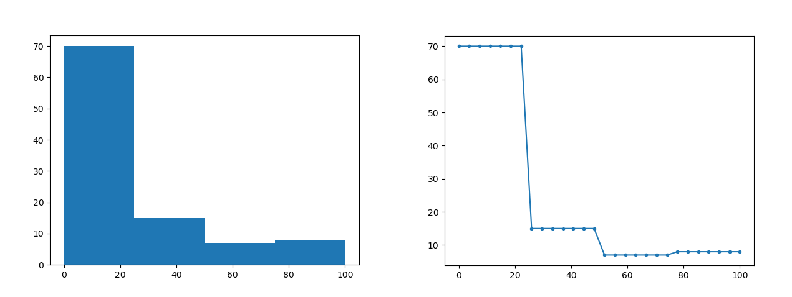

# Limpopo Case Study

## Local Usage
The Limpopo scenario requires a valid Netica license to run. Before running the `NETICA_PASSWORD` environment variable must be set to a valid license key.

Set model inputs in [configs/limpopo.json](../configs/limpopo.json)
- see [README.md](../README.md) for more details on setting inputs

Run the scenario, optionally specifying the path to the Netica file. If no path is specified, the default `neta/limpopo.neta` is used.

```
$ python limpopo.py
$ python limpopo.py neta/limpopo.neta
```

Results are output to [results/Limpopo.csv](../results/Limpopo.csv) as a CSV file.

## Docker Usage
TBD

## Netica/Python Notes
- for Limpopo, the outputs include values of mean and standard deviation for each output node
- Currently, there are issues directly pulling the mean and standard deviation from netica via the API, so the mean and standard deviation are calculated from the distribution of the node
    - mean is calculated as the weighted average the points: `[(12.5, zero_value), (37.5, low_value), (62.5, med_value), (87.5, high_value)]`. `[12.5, 37.5, 62.5, 87.5]` are the centers of each of the four bins in the distribution (`0-25`, `25-50`, `50-75`, `75-100`)
    - standard deviation is estimated via a discrete simulation of the distribution. E.g. if the distribution matches this histogram, and is then the distribution is discritized by sampling many points along the distribution:
    
        

      then the standard formula for standard deviation is used to calculate the standard deviation of the distribution. The actual calculation uses 10000 points instead of the small number shown here. The analytic formula for standard deviation of these types of bar distributions was difficult to derive, so the simulation method was used instead.
    - these methods produce the same values to those shown in the netica application itself, within netica's displayed precision.


## Output Nodes
Output Name | Description
--- | ---
SUB_FISH_END | Maintaining fisheries for livelihoods
SUB_VEG_END | Maintain plants for livelihoods
LIV_VEG_END | Maintain plants for domestic livestock
DOM_WAT_END | Maintain water for domestic use
FLO_ATT_END | Flood attenuation services
RIV_ASS_END | River assimilation capacity
WAT_DIS_END | Maintain water borne diseases
RES_RES_END |Resource resilience
FISH_ECO_END | Maintain fish communities*
VEG_ECO_END | Maintain vegetation communities*
INV_ECO_END | Maintain invertebrate communities*
REC_SPIR_END | Maintain recreation and spiritual act.
TOURISM_END | Maintain tourism
	
